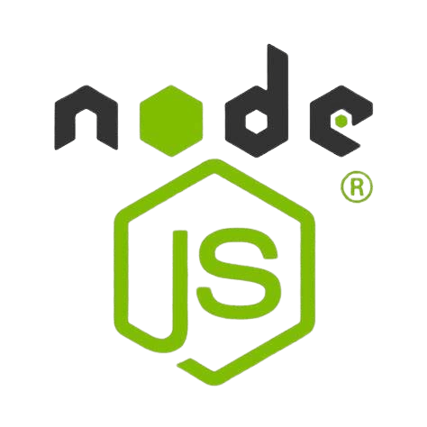

<h2 align="left">Hi! My name is Ujjwal Pandey,</h2>

###

  
I'm SDE-II, Sr. Product Developer at Intellylabs technologies  
    
<strong>Specialization & Education:</strong>

    Web Development, GNIIT from NIIT, BCA from IGNOU, MCA ML & AI - from Amity University Online

###

<h2 align="left">Languages and Tools</h2>

###

Back-end & Databases

###

  
  
  
  
  
  
  
  
  
  
  
  
  
  
  
  
  

###

Front-end and tools

###

 

  
  
  
  
  
  
  
  
  
  
  

###

  
  
  
  
  
  
  
  
  
  
  

###

 

  
  
  

###

  
  
  
  
  

###

 

  

###

 

<h3 align="center">Check out my portfolio: https://ujjwalpandeyjava.github.io/Portfolio/</h3>

###
